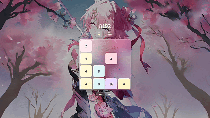

## 1 灵感
自从iOS、iPadOS等Apple系统更新至26版本后，作为一位从iOS Beta1一直用到Beta9，最终升级到正式版的用户，我从最初更新测试版系统时就对Liquid Glass液态玻璃情有独钟，于是便想着仿照这个效果开发一款简单的小游戏8192来练练手。



## 2 游戏内AI自动化算法简述

作为人工智能专业的本科生，AI功能肯定少不了啦。此程序采用简化版Expectimax搜索算法结合启发式评估函数，在可接受的计算量下实现高通关成功率。快和对，我都要！（但是每次都不能完美通关哈，还是有一定的随机性；并且AI运行时有些卡顿，可能没优化好）

### 2.1 Expectimax搜索

默认3层搜索深度（后期可调），权衡效果与性能。**最大层**枚举4个方向（上/右/下/左），调用模拟器 `tryMove` 预测移动结果；**机会层**在所有空格随机生成 <code>2</code>（概率 0.9）或 <code>4</code>（概率 0.1），按期望值回溯。

### 2.2 启发式评估函数
```
score = 空格数 × 1000 + 最大块值 + 行单调性 × 10
```
### 2.3 退化策略
若Expectimax得不到有效移动（极少出现），AI会退化为固定循环，避免停滞。


> 2025年10月5日 USTS